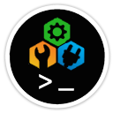

  

  # Emoji &middot; Objects

[← Activities](activities.md) • [Emoji Guide](../emoji.md) • [Docs Home](../../README.md) • **Next:** [Symbols →](symbols.md)

---

The **Objects** group contains **265** emoji &mdash; everyday objects, tools, technology, and clothing.

Use each entry as a `:shortcode:` inside [markup](../markup.md#emoji), or as a strongly-typed
`Emoji` constant. You can also group-qualify a shortcode as `:objects/shortcode:`. See the
[Emoji guide](../emoji.md#group-qualified-shortcodes) for lookup and normalization rules.

| Glyph | Constant | Shortcode |
|:-----:|----------|-----------|
| 🧮 | `Emoji.Abacus` | `:abacus:` |
| 🪗 | `Emoji.Accordion` | `:accordion:` |
| 🩹 | `Emoji.AdhesiveBandage` | `:adhesive_bandage:` |
| ⚗️ | `Emoji.Alembic` | `:alembic:` |
| 🪓 | `Emoji.Axe` | `:axe:` |
| 🎒 | `Emoji.Backpack` | `:backpack:` |
| ⚖️ | `Emoji.BalanceScale` | `:balance_scale:` |
| 🩰 | `Emoji.BalletShoes` | `:ballet_shoes:` |
| 🗳️ | `Emoji.BallotBoxWithBallot` | `:ballot_box_with_ballot:` |
| 🪕 | `Emoji.Banjo` | `:banjo:` |
| 📊 | `Emoji.BarChart` | `:bar_chart:` |
| 🧺 | `Emoji.Basket` | `:basket:` |
| 🛁 | `Emoji.Bathtub` | `:bathtub:` |
| 🔋 | `Emoji.Battery` | `:battery:` |
| 🛏️ | `Emoji.Bed` | `:bed:` |
| 🔔 | `Emoji.Bell` | `:bell:` |
| 🔕 | `Emoji.BellWithSlash` | `:bell_with_slash:` |
| 👙 | `Emoji.Bikini` | `:bikini:` |
| 🧢 | `Emoji.BilledCap` | `:billed_cap:` |
| ✒ | `Emoji.BlackNib` | `:black_nib:` |
| 📘 | `Emoji.BlueBook` | `:blue_book:` |
| 💣 | `Emoji.Bomb` | `:bomb:` |
| 🔖 | `Emoji.Bookmark` | `:bookmark:` |
| 📑 | `Emoji.BookmarkTabs` | `:bookmark_tabs:` |
| 📚 | `Emoji.Books` | `:books:` |
| 🪃 | `Emoji.Boomerang` | `:boomerang:` |
| 🏹 | `Emoji.BowAndArrow` | `:bow_and_arrow:` |
| 💼 | `Emoji.Briefcase` | `:briefcase:` |
| 🩲 | `Emoji.Briefs` | `:briefs:` |
| 🧹 | `Emoji.Broom` | `:broom:` |
| 🫧 | `Emoji.Bubbles` | `:bubbles:` |
| 🪣 | `Emoji.Bucket` | `:bucket:` |
| 📅 | `Emoji.Calendar` | `:calendar:` |
| 📷 | `Emoji.Camera` | `:camera:` |
| 📸 | `Emoji.CameraWithFlash` | `:camera_with_flash:` |
| 🕯️ | `Emoji.Candle` | `:candle:` |
| 🗃️ | `Emoji.CardFileBox` | `:card_file_box:` |
| 📇 | `Emoji.CardIndex` | `:card_index:` |
| 🗂️ | `Emoji.CardIndexDividers` | `:card_index_dividers:` |
| 🪚 | `Emoji.CarpentrySaw` | `:carpentry_saw:` |
| ⛓️ | `Emoji.Chains` | `:chains:` |
| 🪑 | `Emoji.Chair` | `:chair:` |
| 📉 | `Emoji.ChartDecreasing` | `:chart_decreasing:` |
| 📈 | `Emoji.ChartIncreasing` | `:chart_increasing:` |
| 💹 | `Emoji.ChartIncreasingWithYen` | `:chart_increasing_with_yen:` |
| 🚬 | `Emoji.Cigarette` | `:cigarette:` |
| 🗜️ | `Emoji.Clamp` | `:clamp:` |
| 🎬 | `Emoji.ClapperBoard` | `:clapper_board:` |
| 📋 | `Emoji.Clipboard` | `:clipboard:` |
| 📕 | `Emoji.ClosedBook` | `:closed_book:` |
| 📪 | `Emoji.ClosedMailboxWithLoweredFlag` | `:closed_mailbox_with_lowered_flag:` |
| 📫 | `Emoji.ClosedMailboxWithRaisedFlag` | `:closed_mailbox_with_raised_flag:` |
| 👝 | `Emoji.ClutchBag` | `:clutch_bag:` |
| 🧥 | `Emoji.Coat` | `:coat:` |
| ⚰️ | `Emoji.Coffin` | `:coffin:` |
| 🪙 | `Emoji.Coin` | `:coin:` |
| 💽 | `Emoji.ComputerDisk` | `:computer_disk:` |
| 🖱️ | `Emoji.ComputerMouse` | `:computer_mouse:` |
| 🎛️ | `Emoji.ControlKnobs` | `:control_knobs:` |
| 🛋️ | `Emoji.CouchAndLamp` | `:couch_and_lamp:` |
| 🖍️ | `Emoji.Crayon` | `:crayon:` |
| 💳 | `Emoji.CreditCard` | `:credit_card:` |
| ⚔️ | `Emoji.CrossedSwords` | `:crossed_swords:` |
| 👑 | `Emoji.Crown` | `:crown:` |
| 🩼 | `Emoji.Crutch` | `:crutch:` |
| 🗡️ | `Emoji.Dagger` | `:dagger:` |
| 🖥️ | `Emoji.DesktopComputer` | `:desktop_computer:` |
| 🪔 | `Emoji.DiyaLamp` | `:diya_lamp:` |
| 🧬 | `Emoji.Dna` | `:dna:` |
| 💵 | `Emoji.DollarBanknote` | `:dollar_banknote:` |
| 🚪 | `Emoji.Door` | `:door:` |
| 👗 | `Emoji.Dress` | `:dress:` |
| 🩸 | `Emoji.DropOfBlood` | `:drop_of_blood:` |
| 🥁 | `Emoji.Drum` | `:drum:` |
| 📀 | `Emoji.Dvd` | `:dvd:` |
| 🔌 | `Emoji.ElectricPlug` | `:electric_plug:` |
| 🛗 | `Emoji.Elevator` | `:elevator:` |
| 📧 | `Emoji.EMail` | `:e_mail:` |
| ✉ | `Emoji.Envelope` | `:envelope:` |
| 📩 | `Emoji.EnvelopeWithArrow` | `:envelope_with_arrow:` |
| 💶 | `Emoji.EuroBanknote` | `:euro_banknote:` |
| 📠 | `Emoji.FaxMachine` | `:fax_machine:` |
| 🗄️ | `Emoji.FileCabinet` | `:file_cabinet:` |
| 📁 | `Emoji.FileFolder` | `:file_folder:` |
| 🎞️ | `Emoji.FilmFrames` | `:film_frames:` |
| 📽️ | `Emoji.FilmProjector` | `:film_projector:` |
| 🧯 | `Emoji.FireExtinguisher` | `:fire_extinguisher:` |
| 🔦 | `Emoji.Flashlight` | `:flashlight:` |
| 🥿 | `Emoji.FlatShoe` | `:flat_shoe:` |
| 💾 | `Emoji.FloppyDisk` | `:floppy_disk:` |
| 🪈 | `Emoji.Flute` | `:flute:` |
| 🪭 | `Emoji.FoldingHandFan` | `:folding_hand_fan:` |
| 🖋️ | `Emoji.FountainPen` | `:fountain_pen:` |
| ⚱️ | `Emoji.FuneralUrn` | `:funeral_urn:` |
| ⚙️ | `Emoji.Gear` | `:gear:` |
| 💎 | `Emoji.GemStone` | `:gem_stone:` |
| 👓 | `Emoji.Glasses` | `:glasses:` |
| 🧤 | `Emoji.Gloves` | `:gloves:` |
| 🥽 | `Emoji.Goggles` | `:goggles:` |
| 🎓 | `Emoji.GraduationCap` | `:graduation_cap:` |
| 📗 | `Emoji.GreenBook` | `:green_book:` |
| 🎸 | `Emoji.Guitar` | `:guitar:` |
| 🪮 | `Emoji.HairPick` | `:hair_pick:` |
| 🔨 | `Emoji.Hammer` | `:hammer:` |
| ⚒️ | `Emoji.HammerAndPick` | `:hammer_and_pick:` |
| 🛠️ | `Emoji.HammerAndWrench` | `:hammer_and_wrench:` |
| 🪬 | `Emoji.Hamsa` | `:hamsa:` |
| 👜 | `Emoji.Handbag` | `:handbag:` |
| 🪉 | `Emoji.Harp` | `:harp:` |
| 🎧 | `Emoji.Headphone` | `:headphone:` |
| 🪦 | `Emoji.Headstone` | `:headstone:` |
| 👠 | `Emoji.HighHeeledShoe` | `:high_heeled_shoe:` |
| 🥾 | `Emoji.HikingBoot` | `:hiking_boot:` |
| 🪝 | `Emoji.Hook` | `:hook:` |
| 🪪 | `Emoji.IdentificationCard` | `:identification_card:` |
| 📥 | `Emoji.InboxTray` | `:inbox_tray:` |
| 📨 | `Emoji.IncomingEnvelope` | `:incoming_envelope:` |
| 👖 | `Emoji.Jeans` | `:jeans:` |
| 🔑 | `Emoji.Key` | `:key:` |
| ⌨️ | `Emoji.Keyboard` | `:keyboard:` |
| 👘 | `Emoji.Kimono` | `:kimono:` |
| 🥼 | `Emoji.LabCoat` | `:lab_coat:` |
| 🏷️ | `Emoji.Label` | `:label:` |
| 🪜 | `Emoji.Ladder` | `:ladder:` |
| 💻 | `Emoji.Laptop` | `:laptop:` |
| 📒 | `Emoji.Ledger` | `:ledger:` |
| 🎚️ | `Emoji.LevelSlider` | `:level_slider:` |
| 💡 | `Emoji.LightBulb` | `:light_bulb:` |
| 🔗 | `Emoji.Link` | `:link:` |
| 🖇️ | `Emoji.LinkedPaperclips` | `:linked_paperclips:` |
| 💄 | `Emoji.Lipstick` | `:lipstick:` |
| 🔒 | `Emoji.Locked` | `:locked:` |
| 🔐 | `Emoji.LockedWithKey` | `:locked_with_key:` |
| 🔏 | `Emoji.LockedWithPen` | `:locked_with_pen:` |
| 🪘 | `Emoji.LongDrum` | `:long_drum:` |
| 🧴 | `Emoji.LotionBottle` | `:lotion_bottle:` |
| 📢 | `Emoji.Loudspeaker` | `:loudspeaker:` |
| 🪫 | `Emoji.LowBattery` | `:low_battery:` |
| 🧲 | `Emoji.Magnet` | `:magnet:` |
| 🔍 | `Emoji.MagnifyingGlassTiltedLeft` | `:magnifying_glass_tilted_left:` |
| 🔎 | `Emoji.MagnifyingGlassTiltedRight` | `:magnifying_glass_tilted_right:` |
| 👞 | `Emoji.MansShoe` | `:mans_shoe:` |
| 🪇 | `Emoji.Maracas` | `:maracas:` |
| 📣 | `Emoji.Megaphone` | `:megaphone:` |
| 📝 | `Emoji.Memo` | `:memo:` |
| 🎤 | `Emoji.Microphone` | `:microphone:` |
| 🔬 | `Emoji.Microscope` | `:microscope:` |
| 🪖 | `Emoji.MilitaryHelmet` | `:military_helmet:` |
| 🪞 | `Emoji.Mirror` | `:mirror:` |
| 🗿 | `Emoji.Moai` | `:moai:` |
| 📱 | `Emoji.MobilePhone` | `:mobile_phone:` |
| 📲 | `Emoji.MobilePhoneWithArrow` | `:mobile_phone_with_arrow:` |
| 💰 | `Emoji.MoneyBag` | `:money_bag:` |
| 💸 | `Emoji.MoneyWithWings` | `:money_with_wings:` |
| 🪤 | `Emoji.MouseTrap` | `:mouse_trap:` |
| 🎥 | `Emoji.MovieCamera` | `:movie_camera:` |
| 🎹 | `Emoji.MusicalKeyboard` | `:musical_keyboard:` |
| 🎵 | `Emoji.MusicalNote` | `:musical_note:` |
| 🎶 | `Emoji.MusicalNotes` | `:musical_notes:` |
| 🎼 | `Emoji.MusicalScore` | `:musical_score:` |
| 🔇 | `Emoji.MutedSpeaker` | `:muted_speaker:` |
| 🧿 | `Emoji.NazarAmulet` | `:nazar_amulet:` |
| 👔 | `Emoji.Necktie` | `:necktie:` |
| 📰 | `Emoji.Newspaper` | `:newspaper:` |
| 📓 | `Emoji.Notebook` | `:notebook:` |
| 📔 | `Emoji.NotebookWithDecorativeCover` | `:notebook_with_decorative_cover:` |
| 🔩 | `Emoji.NutAndBolt` | `:nut_and_bolt:` |
| 🗝️ | `Emoji.OldKey` | `:old_key:` |
| 🩱 | `Emoji.OnePieceSwimsuit` | `:one_piece_swimsuit:` |
| 📖 | `Emoji.OpenBook` | `:open_book:` |
| 📂 | `Emoji.OpenFileFolder` | `:open_file_folder:` |
| 📭 | `Emoji.OpenMailboxWithLoweredFlag` | `:open_mailbox_with_lowered_flag:` |
| 📬 | `Emoji.OpenMailboxWithRaisedFlag` | `:open_mailbox_with_raised_flag:` |
| 💿 | `Emoji.OpticalDisk` | `:optical_disk:` |
| 📙 | `Emoji.OrangeBook` | `:orange_book:` |
| 📤 | `Emoji.OutboxTray` | `:outbox_tray:` |
| 📦 | `Emoji.Package` | `:package:` |
| 📄 | `Emoji.PageFacingUp` | `:page_facing_up:` |
| 📟 | `Emoji.Pager` | `:pager:` |
| 📃 | `Emoji.PageWithCurl` | `:page_with_curl:` |
| 🖌️ | `Emoji.Paintbrush` | `:paintbrush:` |
| 📎 | `Emoji.Paperclip` | `:paperclip:` |
| 🖊️ | `Emoji.Pen` | `:pen:` |
| ✏ | `Emoji.Pencil` | `:pencil:` |
| 🧫 | `Emoji.PetriDish` | `:petri_dish:` |
| ⛏️ | `Emoji.Pick` | `:pick:` |
| 💊 | `Emoji.Pill` | `:pill:` |
| 🪧 | `Emoji.Placard` | `:placard:` |
| 🪠 | `Emoji.Plunger` | `:plunger:` |
| 📯 | `Emoji.PostalHorn` | `:postal_horn:` |
| 📮 | `Emoji.Postbox` | `:postbox:` |
| 💷 | `Emoji.PoundBanknote` | `:pound_banknote:` |
| 📿 | `Emoji.PrayerBeads` | `:prayer_beads:` |
| 🖨️ | `Emoji.Printer` | `:printer:` |
| 👛 | `Emoji.Purse` | `:purse:` |
| 📌 | `Emoji.Pushpin` | `:pushpin:` |
| 📻 | `Emoji.Radio` | `:radio:` |
| 🪒 | `Emoji.Razor` | `:razor:` |
| 🧾 | `Emoji.Receipt` | `:receipt:` |
| 🏮 | `Emoji.RedPaperLantern` | `:red_paper_lantern:` |
| ⛑️ | `Emoji.RescueWorkersHelmet` | `:rescue_workers_helmet:` |
| 💍 | `Emoji.Ring` | `:ring:` |
| 🗞️ | `Emoji.RolledUpNewspaper` | `:rolled_up_newspaper:` |
| 🧻 | `Emoji.RollOfPaper` | `:roll_of_paper:` |
| 📍 | `Emoji.RoundPushpin` | `:round_pushpin:` |
| 👟 | `Emoji.RunningShoe` | `:running_shoe:` |
| 🧷 | `Emoji.SafetyPin` | `:safety_pin:` |
| 🦺 | `Emoji.SafetyVest` | `:safety_vest:` |
| 🥻 | `Emoji.Sari` | `:sari:` |
| 📡 | `Emoji.SatelliteAntenna` | `:satellite_antenna:` |
| 🎷 | `Emoji.Saxophone` | `:saxophone:` |
| 🧣 | `Emoji.Scarf` | `:scarf:` |
| ✂ | `Emoji.Scissors` | `:scissors:` |
| 🪛 | `Emoji.Screwdriver` | `:screwdriver:` |
| 📜 | `Emoji.Scroll` | `:scroll:` |
| 🛡️ | `Emoji.Shield` | `:shield:` |
| 🛍️ | `Emoji.ShoppingBags` | `:shopping_bags:` |
| 🛒 | `Emoji.ShoppingCart` | `:shopping_cart:` |
| 🩳 | `Emoji.Shorts` | `:shorts:` |
| 🪏 | `Emoji.Shovel` | `:shovel:` |
| 🚿 | `Emoji.Shower` | `:shower:` |
| 🧼 | `Emoji.Soap` | `:soap:` |
| 🧦 | `Emoji.Socks` | `:socks:` |
| 🔊 | `Emoji.SpeakerHighVolume` | `:speaker_high_volume:` |
| 🔈 | `Emoji.SpeakerLowVolume` | `:speaker_low_volume:` |
| 🔉 | `Emoji.SpeakerMediumVolume` | `:speaker_medium_volume:` |
| 🗓️ | `Emoji.SpiralCalendar` | `:spiral_calendar:` |
| 🗒️ | `Emoji.SpiralNotepad` | `:spiral_notepad:` |
| 🧽 | `Emoji.Sponge` | `:sponge:` |
| 🩺 | `Emoji.Stethoscope` | `:stethoscope:` |
| 📏 | `Emoji.StraightRuler` | `:straight_ruler:` |
| 🎙️ | `Emoji.StudioMicrophone` | `:studio_microphone:` |
| 🕶️ | `Emoji.Sunglasses` | `:sunglasses:` |
| 💉 | `Emoji.Syringe` | `:syringe:` |
| 📆 | `Emoji.TearOffCalendar` | `:tear_off_calendar:` |
| ☎️ | `Emoji.Telephone` | `:telephone:` |
| 📞 | `Emoji.TelephoneReceiver` | `:telephone_receiver:` |
| 🔭 | `Emoji.Telescope` | `:telescope:` |
| 📺 | `Emoji.Television` | `:television:` |
| 🧪 | `Emoji.TestTube` | `:test_tube:` |
| 🩴 | `Emoji.ThongSandal` | `:thong_sandal:` |
| 🚽 | `Emoji.Toilet` | `:toilet:` |
| 🧰 | `Emoji.Toolbox` | `:toolbox:` |
| 🪥 | `Emoji.Toothbrush` | `:toothbrush:` |
| 🎩 | `Emoji.TopHat` | `:top_hat:` |
| 🖲️ | `Emoji.Trackball` | `:trackball:` |
| 🪎️ | `Emoji.TreasureChest` | `:treasure_chest:` |
| 📐 | `Emoji.TriangularRuler` | `:triangular_ruler:` |
| 🪊️ | `Emoji.Trombone` | `:trombone:` |
| 🎺 | `Emoji.Trumpet` | `:trumpet:` |
| 👕 | `Emoji.TShirt` | `:t_shirt:` |
| 🔓 | `Emoji.Unlocked` | `:unlocked:` |
| 📹 | `Emoji.VideoCamera` | `:video_camera:` |
| 📼 | `Emoji.Videocassette` | `:videocassette:` |
| 🎻 | `Emoji.Violin` | `:violin:` |
| 🗑️ | `Emoji.Wastebasket` | `:wastebasket:` |
| 🦯 | `Emoji.WhiteCane` | `:white_cane:` |
| 🪟 | `Emoji.Window` | `:window:` |
| 👢 | `Emoji.WomansBoot` | `:womans_boot:` |
| 👚 | `Emoji.WomansClothes` | `:womans_clothes:` |
| 👒 | `Emoji.WomansHat` | `:womans_hat:` |
| 👡 | `Emoji.WomansSandal` | `:womans_sandal:` |
| 🔧 | `Emoji.Wrench` | `:wrench:` |
| 🩻 | `Emoji.XRay` | `:x_ray:` |
| 💴 | `Emoji.YenBanknote` | `:yen_banknote:` |

---

[← Activities](activities.md) • [Emoji Guide](../emoji.md) • [Docs Home](../../README.md) • **Next:** [Symbols →](symbols.md)
